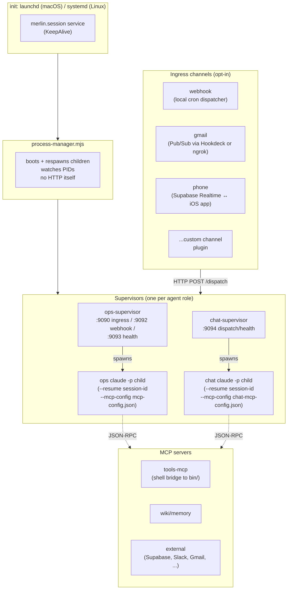
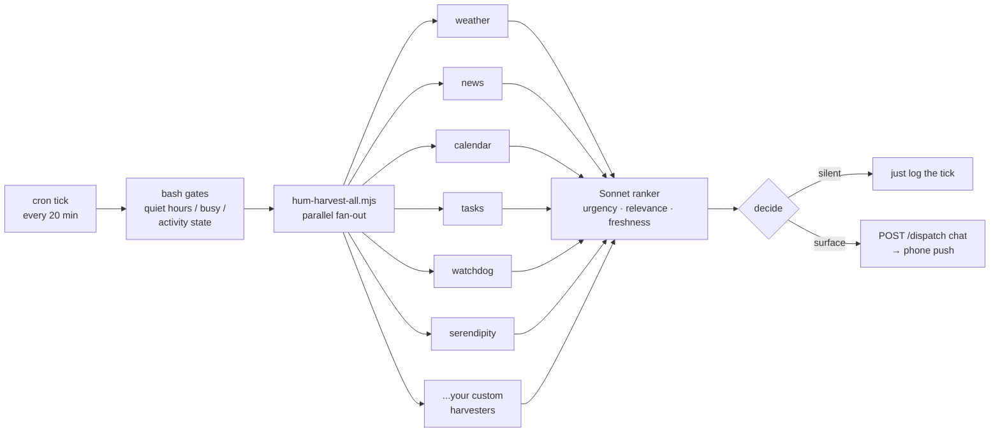

# Merlin Architecture

Merlin is an open-source 24/7 personal-agent OS built on top of Claude Code's `claude -p` subprocess. It runs persistent agents (one or more) under supervisors that restart `claude -p` on crash, wire those agents to ingress channels (webhook, Gmail, phone, custom), drive scheduled jobs from markdown playbooks, and back the whole thing with a wiki/SQLite memory layer.

This document is the map. Read it first when something doesn't make sense — every other component doc assumes you understand what's here.

> **Status of this repository.** Merlin is the open-source, sanitized lineage of a working personal-agent system. The kernel substrate has been generalized; integrations are opt-in; a small set of reference jobs ship out of the box. You're expected to write your own jobs, your own taste profile, and your own playbook overrides on top of the kernel.

---

## Mission

Build a system where one or more LLM-powered agents can:

- **Stay alive 24/7** on a single host (Mac mini or Linux server). Crashes auto-recover. Sessions persist across restarts via `claude --resume`.
- **Receive work from multiple ingress channels** — incoming email, scheduled cron, chat messages from a phone, ad-hoc webhooks — without each channel rewriting the agent's main loop.
- **Run scheduled jobs from markdown playbooks** that you author and edit live. No agent restart needed when you change a job.
- **Remember things across sessions** through a wiki/SQLite store with full-text + embedding search.
- **Stay observable** — per-turn cost, per-job attribution, restart counts, supervisor uptime, watchdog signals.

The kernel makes none of this user-specific. The agents you spawn, the jobs you write, and the channels you enable shape what Merlin becomes for you.

---

## Process topology



Three things to internalize:

1. **process-manager is the only ever-running child of init.** Everything else (supervisors, channel daemons, anything else you boot) is a child of process-manager. Kill the process-manager and the tree comes down; respawn it and the tree rebuilds.
2. **Supervisors don't *run* the agent — they wrap it.** The supervisor process is long-lived; the inner `claude -p` child is the agent. Restart semantics differ: `POST /restart` on a supervisor rotates only the inner child; the outer supervisor PID keeps its uptime. Watchdog logs that say "Crash loop detected → POST /restart" but show unchanged `restarts=N up=Xh` in `merlin status` are not a bug.
3. **Channels are HTTP POSTers, not state holders.** Each channel daemon (gmail, webhook, phone) is just a translator: receive an event in its own protocol, normalize it, `POST /dispatch` to the appropriate supervisor. The supervisor + agent do the actual thinking.

---

## Core components

| Component | Where | What it does |
|---|---|---|
| **process-manager** | `agent/bin/process-manager.mjs` | Init-style supervisor for the supervisors. Boots them, respawns on crash, no HTTP of its own. Sources `.env` so `${ENV_VAR}` substitution in `.mcp.json` works for child claude sessions. |
| **chat-supervisor** | `agent/supervisor/chat-supervisor.mjs` | Wraps `claude -p` for the chat agent. HTTP :9094: `POST /dispatch` (route an inbound chat message), `GET /health`, `POST /restart`, `POST /rotate` (force a fresh session). |
| **ops-supervisor** | `agent/supervisor/index.mjs` | Wraps `claude -p` for the ops agent. Three ports: :9090 (Gmail Pub/Sub push), :9092 (webhook, auth'd), :9093 (health/cost/rotate/restart). |
| **claude-session** | `agent/supervisor/claude-session.mjs` | The actual `claude -p` invocation. Handles stream-JSON transport, session persistence (state.json), env-var scrubbing, `--mcp-config` wiring. |
| **dispatcher** | `agent/supervisor/dispatcher.mjs` | Queues inbound jobs for a supervisor; persists the queue on disk so a supervisor crash doesn't drop in-flight work. |
| **tools-mcp** | `agent/tools-mcp/index.mjs` | MCP shell bridge. Discovers `bin/*` and exposes each as a tool. Lets the agent invoke any CLI without coupling the kernel to specific commands. |
| **watchdog** | `agent/scripts/watchdog.sh` | Cron-driven (every 2 min). Probes liveness, detects crash loops, gates webhook dispatches on `childAlive`. Follows a strict heal-then-alert pattern: exhaust auto-repair before paging the user. |

---

## Agents and roles

Merlin doesn't hardcode "chat" and "ops" — those are *agent role names* defined in `agent/config/agents.json`. Each role is an entry like:

```jsonc
{
  "agents": {
    "ops": {
      "model": "opus",
      "fallbackModel": "sonnet",
      "effort": "xhigh",
      "cwd": "agent/ops-agent",
      "runtime": "supervisor",
      "permissionMode": "bypassPermissions",
      "allowedTools": ["Bash", "Read", "Edit", "Write", "WebFetch", "..."],
      "supervisor": {
        "webhookPort": 9092,
        "healthPort": 9093
      }
    }
  }
}
```

You can:
- Add a third agent (`research`, `legal`, whatever) by adding an entry.
- Have multiple supervisors per host, each on different ports.
- Run a single-agent Merlin if you don't need the chat/ops split.

The agent's behavior is shaped by the `CLAUDE.md` file in its `cwd` plus the MCP servers it loads.

---

## Channels (ingress plugins)

A channel is anything that takes an external event and turns it into a `POST /dispatch` call to one of the supervisors. Channels ship as opt-in plugins under `agent/{name}-channel/`. Each one is its own Node package with a small footprint.

The channels in this tree:

| Channel | Reaches | Use case |
|---|---|---|
| `agent/webhook-channel/` | ops :9092 | Local cron dispatch — scheduled trigger scripts POST a webhook to fire a job |
| `agent/gmail-channel/` | ops :9090 | Inbound email via Google Pub/Sub push (typically tunneled with Hookdeck or ngrok) |
| `agent/phone-channel/` | chat :9094 | Real-time chat from the companion iOS app via Supabase Realtime |
| `agent/dispatch-bridge/` | chat :9094 | Server-to-server push-notification ingest, useful for pushing system alerts into chat |

A channel doesn't have to be HTTP — it just has to end in `POST /dispatch`. You can write a Slack channel, a SMS channel (Twilio), a generic-API-polling channel. Drop it in `agent/`, point its package.json at the entry mjs, give it a port if it needs one, and the process-manager picks it up.

The **dispatch contract** (what a channel sends to a supervisor):
```jsonc
POST /dispatch
Content-Type: application/json
Authorization: Bearer <token-from-secrets/webhook-token>

{
  "source": "gmail|webhook|phone|custom",
  "job": "<job-name-or-null>",
  "content": "<text the agent should react to>",
  "metadata": { "...source-specific..." }
}
```

---

## Jobs (markdown playbooks)

Scheduled work in Merlin is **playbook-driven**, not code-driven. A job is two pieces:

1. **A trigger script** under `agent/scripts/trigger-<job>.sh` — bash, sources auth helpers, gates on prerequisites, POSTs the webhook to fire the job.
2. **A playbook** under `agent/ops-agent/jobs/<job>.md` — the actual instructions the agent reads when dispatched. Plain markdown.

The registry of active jobs is `system/tasks.json` — each entry has a name, cron schedule, trigger script path, and metadata. The process that drives the schedule is whatever you wire to cron / launchd / systemd (example crontabs ship in `installer/`).

**Why markdown playbooks instead of code.** You edit the playbook in your editor; the next firing of the job picks up the new instructions, no agent restart needed, no deploy. The agent reads the playbook as instructions in its first user-turn, then proceeds. This is the lowest-friction iteration loop we've found for agentic systems.

**Reference jobs ship:**
- `agent/ops-agent/jobs/morning-digest.md` — daily summary of calendar/email/tasks, pushed to chat
- `agent/ops-agent/jobs/hum.md` and `hum-{canary,daily,ideation,operations,review}.md` — the ambient-awareness loop (see § Hum)

You write your own from there.

---

## Hum — the ambient awareness loop

Hum is a deliberate-design idle loop that runs every 20 minutes by default, gathers candidate observations from a set of pluggable **harvesters**, asks a Sonnet subagent to rank them, and optionally surfaces one as a chat ping. It's how the agent goes from "passive responder" to "ambient awareness."



The harness (`agent/scripts/hum-harvest-all.mjs`) is generic. The harvesters that ship in `agent/scripts/hum-harvesters/` are intentionally minimal — `weather`, `news`, `calendar`, `tasks`, `watchdog`, `serendipity` plus the shared `_common.mjs`. **You add the harvesters that surface signals you actually care about** (stocks, fitness data, RSS feeds, repo activity, etc.).

The suggestion ledger (`lib/suggestion-{history,key,recall}.mjs`) gives the system memory of "what have we surfaced, and how did the user respond?" — so we don't pester with the same suggestion twice and we honor explicit rejections.

The hum-intent file (a markdown doc you author) defines what the loop should and shouldn't surface for you. Hum-review (a weekly job) reads the intent and grades the past week against it.

---

## MCP shell bridge

`agent/tools-mcp/index.mjs` is one MCP server that exposes the entire `bin/` directory as MCP tools. Each CLI becomes a callable tool with stdin/stdout/exit-code conventions.

Why: most agent work is "run this script and read the output." Going through MCP gives you (a) structured tool-call traces for the conversation history, (b) per-tool permissioning via `allowedTools`, and (c) a uniform shape no matter what the script is written in (bash, Node, Python).

When you add a new CLI under `bin/`, it shows up in the agent's tool list automatically. There's nothing to register.

---

## Memory layer (wiki/SQLite)

Long-term memory is stored as markdown pages, indexed in SQLite with FTS5 and nomic-embed-text embeddings. The system is described in detail in [wiki-architecture.md](wiki-architecture.md); the short version:

- **Three tiers of memory access:** (1) pinned-subset + recent-days, always loaded at agent start via a SessionStart hook; (2) on-demand search via `wiki_search` MCP tool; (3) full read via `wiki_read`.
- **DB-as-truth.** The SQLite `pages` table is canonical; markdown files on disk are rendered from it. Edits round-trip cleanly.
- **Embedded entities + wikilinks.** `[[page-id]]` syntax creates graph edges. The auto-linker promotes canonical concepts (people, places, projects, tools) to wikilinks automatically.
- **Auto-pin audit.** Weekly job watches which pages actually get hit; promotes high-traffic pages, demotes idle ones.

Backed by:
- `lib/wiki-store.js` — the DB-as-truth layer
- `lib/wiki-linker.js` — auto-linking + entity extraction
- `lib/wiki-serve.js` — HTTP browser at `:9096` for reading wiki pages from anywhere on the LAN/Tailscale
- `lib/memory-store.js` — the legacy `memory` CLI's chunk index (FTS5 + embeddings, still used during the wiki migration)

---

## Companion apps

Two iOS/macOS apps ship in this tree under `apps/`:

| App | Purpose | Path |
|---|---|---|
| **Companion** | Chat with the agent. Push notifications, location publishing, Wi-Fi/audio context, link previews, photo embedding, an embedded wiki browser. The phone-channel reads from / writes to a Supabase Realtime channel that the companion app subscribes to. | `apps/companion/` |
| **Spotter** | Fitness tracker (workouts, sets, reps, HealthKit). Writes to its own Supabase project; the agent reads it via a hum-harvester you author (see § Hum) to surface workout reminders / streak feedback. | `apps/spotter/` |

Both apps are written in SwiftUI (iOS 26, Swift 6, strict concurrency). They share patterns (Google Sign-In → Supabase session exchange, Face ID gate, Supabase service-role-key proxy via `lib/supabase-rest.js`) but are independent codebases. You can ship either, both, or replace one with a web UI.

---

## Auth model

Two modes, picked via `agent/config/agents.json`:

| Mode | Setup | Tradeoffs |
|---|---|---|
| **API key (default)** | Set `ANTHROPIC_API_KEY` in `.env`. Agents bill the API key. | Easiest to set up. Pay-per-token. No subscription dependency. |
| **Claude Max subscription** | Authenticate via `claude` once on the host (`~/.claude/.credentials.json`). Set `unsetEnv: ["ANTHROPIC_API_KEY"]` in `agent/supervisor/claude-session.mjs` so the API key is stripped from child env. | Fixed monthly cost regardless of usage. Max-only is also a *hardening profile*: if Max is unavailable, agents are down — no silent fallback to API-key calls — which forces the user to fix the real problem rather than letting a degraded proxy quietly run up bills. See `docs/hardening.md`. |

Both modes are first-class. The kernel is auth-mode-neutral — pick whichever fits.

---

## Observability

| Surface | What it shows |
|---|---|
| `merlin status` | One-screen view: supervisor uptimes, child restart counts, last 5 jobs run, last hum tick, error counts |
| `merlin cost-report` | Per-day, per-agent, per-job cost attribution. Reads the `cost.ndjson` + `job-costs.ndjson` event logs the supervisors write per turn. `--push` rolls the per-day totals up to the hosted `/usage` endpoint (`apps/telemetry`) for durable, cross-host monitoring; wired as the nightly `usage-push` job in `system/tasks.json`. |
| `agent/logs/supervisor-{ops,chat}/events.ndjson` | Full session stream (one JSON line per turn). Survives restarts. |
| `merlin logs <job>` | Tail the log file for a specific job. |
| `GET :9093/health` | JSON: `{childAlive, lastTurnAt, turnCount, cost, restarts, up}`. Webhook channels check this before dispatching to avoid queueing into a dead agent. |
| Heartbeat sender | LaunchAgent / systemd timer that POSTs system health to a configurable destination every 2 min (Firebase RTDB, generic webhook, whatever you wire). |
| Watchdog | Cron every 2 min. Detects stuck/stale agents, OAuth-expiry, channel disconnects. Follows heal-then-alert: a probe failure self-heals first, only escalates on consecutive failures. |

---

## Repository layout

```
agent/                 the kernel
  bin/                 process-manager + supporting bins
  chat-agent/          chat agent's CLAUDE.md + cwd
  ops-agent/           ops agent's CLAUDE.md + jobs/ + cwd
  config/              agents.json + schema + loader
  dispatch-bridge/     server-to-server dispatch channel
  gmail-channel/       opt-in Gmail Pub/Sub ingress
  phone-channel/       opt-in companion-app realtime ingress
  webhook-channel/     opt-in HTTP webhook ingress
  scripts/             watchdog, gmail setup/renew, log rotation, hum harness + harvesters
  supervisor/          chat-supervisor, ops-supervisor (= index.mjs), claude-session, dispatcher, queue-persist, etc.
  test/                kernel test suite (chaos sim, mocks, resilience, resource-leak)
  tools-mcp/           MCP shell bridge → bin/
  lib/                 managed-process, priority-dispatcher

apps/
  companion/           iOS/macOS chat app
  spotter/             iOS fitness tracker

bin/                   user-facing CLIs (merlin, wiki, memory, email-send, etc.)
lib/                   shared libraries (wiki-store, memory-store, local-llm,
                       supabase-rest, apns-push, suggestion ledger, ...)

system/
  architecture.md      this doc
  wiki-architecture.md memory layer detail
  tasks.json           scheduled-job registry
  services.json        runtime service registry

docs/                  user-facing guides (TODO — getting started, writing a job, hardening, ...)
```

---

## Run lifecycle

What happens from cold boot to "agent answered me":

1. **`init` boots the host service.** macOS: `launchd` brings up `merlin.session` LaunchAgent. Linux: `systemd` brings up the analogous unit. Both have `KeepAlive=true`.
2. **`merlin.session` execs `agent/bin/process-manager.mjs`.** Process-manager sources `.env` so env-var substitution in `.mcp.json` resolves.
3. **process-manager spawns the supervisors as direct children.** Each supervisor in turn:
   - Reads `agent/config/agents.json` to find its role's config.
   - Resolves the session-id from its state file (`agent/supervisor/state/{role}/session.json`).
   - Spawns `claude -p --resume <sid> --mcp-config <config>.json --output-format stream-json` with `cwd` set per agents.json.
   - Listens on its assigned ports (health, webhook, etc.).
4. **Channels start as additional children of process-manager.** Each one binds its port (or its Pub/Sub subscription, or its Supabase Realtime listener) and is ready.
5. **At first event,** the relevant channel calls `POST /dispatch` on its supervisor. Supervisor enqueues, hands the message to the inner claude child, streams the response back. Cost + timing are written to the per-supervisor `events.ndjson` / `cost.ndjson`. If the channel produces a reply (e.g., a phone-channel chat message), the agent uses an MCP tool to send it back through the channel.

Restart semantics:
- `POST :9093/restart` (ops) → kills the inner claude-session child only. Supervisor PID keeps its uptime. Used by the watchdog when it detects a hung child.
- `kill <supervisor-pid>` → process-manager respawns the supervisor. The inner child's session-id persists, so the next start is `--resume` of the same conversation.
- `kill <process-manager-pid>` → `init` respawns it. The supervisors then come back, the children come back, the session-ids persist.

---

## Conventions

A few patterns that show up everywhere. Internalize them.

**Secrets always read from env**, never hardcoded in tracked files. All three tracked `.mcp.json` files (root, `agent/`, `agent/ops-agent/`) use `${SUPABASE_ACCESS_TOKEN}` substitution; values live in `.env` (gitignored). Same pattern for any other secret.

**Heal-then-alert.** The watchdog must exhaust auto-repair before paging. A probe failure self-heals first; the user-facing alert only goes out once the heal has demonstrably failed. Don't let a degraded system spam the user with manual-intervention pings they can't act on.

**Inner-child restart vs supervisor restart vs process-manager restart.** Know which one you're triggering. Most agent issues need only the inner-child rotation. The watchdog uses `POST /restart` (inner only). A code change to the supervisor itself requires killing the supervisor PID. A code change to process-manager requires `launchctl kickstart -k`.

**Self-awareness, in writing.** Every capability/architecture change is supposed to update its in-repo doc in the same commit. This file. The job's playbook in `agent/ops-agent/jobs/<job>.md`. The relevant `CLAUDE.md`. The schema docs. The agent never learns its state by reading `git log` — it learns by reading the docs. Stale docs are worse than missing docs.

---

## What ships in v1 vs. what you build

| Ships | Doesn't ship |
|---|---|
| Supervisor + process-manager kernel | Specific personal jobs (calendar/email/property/etc.) |
| 4 channel plugins (webhook, gmail, phone, dispatch-bridge) | Slack/Discord/SMS channels (write your own) |
| MCP shell bridge | Specific integrations (write your own) |
| Hum harness + 7 generic harvesters | Your taste profile, your hum-intent.md |
| Wiki/memory layer | Your memory corpus |
| Two companion apps (chat, fitness) | App icons, your bundle ID, your team ID |
| Watchdog + observability | Your alerting destinations |
| Reference job: morning-digest | The 60+ personal jobs from the parent project |

You're starting with a working kernel and a small reference set, not a turnkey assistant. Plan accordingly.

---

## Further reading

- `system/wiki-architecture.md` — memory layer detail
- `agent/CLAUDE.md` — agent rules (auth model, calendar conventions, priority routing)
- `agent/ops-agent/CLAUDE.md` — ops-agent-specific rules
- `agent/chat-agent/CLAUDE.md` — chat-agent-specific rules
- `agent/supervisor/README.md` — supervisor internals
- `docs/` — user-facing guides (in progress; not all written yet)
